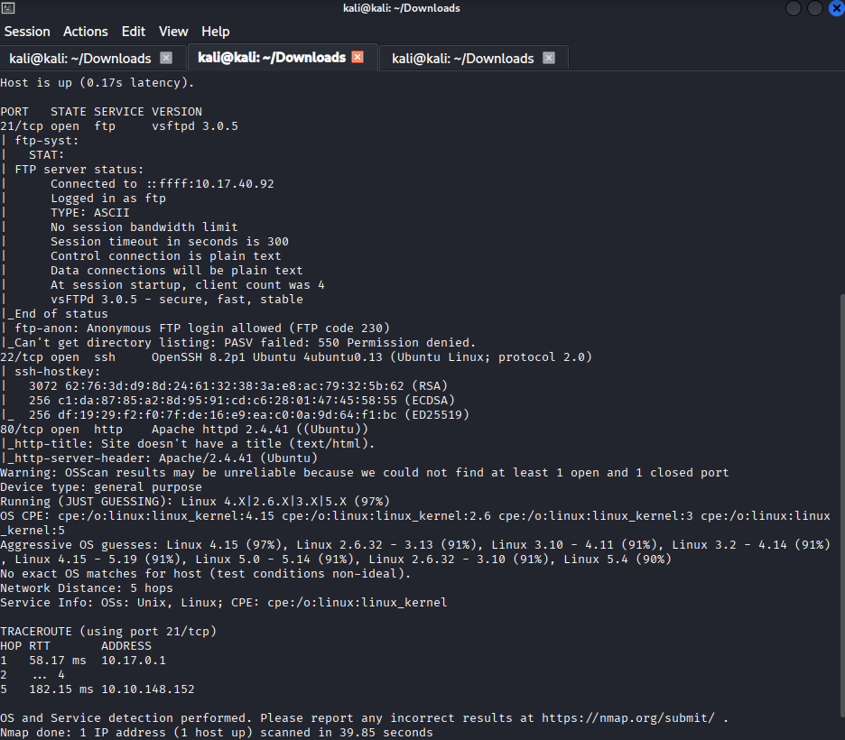
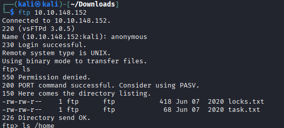
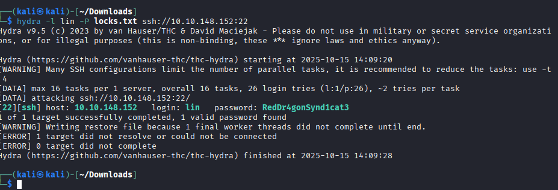
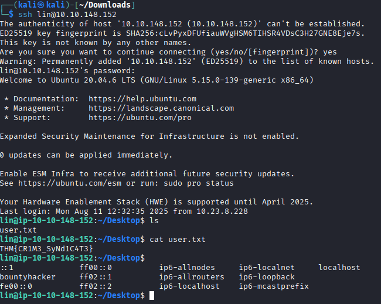
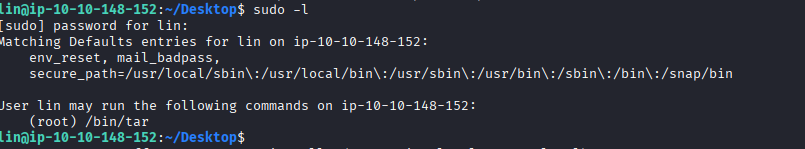

# Room: Bounty Hacker # (https://tryhackme.com/room/cowboyhacker)
---
## Description ##
- We have to find the user & password.
- find the user flag.
- find the root flag.
---
## Tools needed ## 
- linux
- nmap
- Hydra
---
## Skills Required ##
- linux(tools & commands)
- Privilage Escalation
- security
- tar
---
## Steps to complete this machine ##

1. ### Network & Ports scanning ###
   - Use the Nmap for scanning the target network and ports to find the important information about open ports.
   ```bash
   nmap -T5 -p- -VV -sV 10.10.148.152
   ```
   - `-T5` Aggressive scan
   - `-p-` Scan ports from 1 to 1000
   - `-sV` To find Service Versions
   - `-VV` For Verbose scanning
 - Output
   
 - The first interesting information from the nmap scan result is “anonymous” login is allowed through FTP protocol. We can do this by connecting using: ftp 10.10.148.152.
   
 2. ### FTP anonymous login ###
   - When prompted to enter a username/name, use: anonymous and login.
   - Let's see what is on the FTP server where we're logged in.
     
   - Output:
  
   

   - Download Both the files(i.e locks.txt & task.txt) on your attacker machine.
   - ```bash
     get task.txt
     get locks.txt
     ```
     use these command to download both files.
   - Open task.txt to obtain the answer on who wrote the task list by using cat command. cat task.txt
   - Output: 
    `d└─$ cat task.txt  
      1.) Protect Vicious.
      2.) Plan for Red Eye pickup on the moon.
      -lin`
     
  3. ## Bruteforce with text file found on ftp server using Hydra ##

     - Looking at the nmap scan result we have above, the only other service that we can bruteforce is SSH.
     - let's take a look into locks.txt using `cat locks.txt`
     - It's password file we can use to bruteforce.
     - We don't know which username to use but we can try and use the author of file task.txt i.e. `lin`
     - Let's brute force the SSH service using hydra with username as `lin` (author name of task.txt).
     - Let's use locks.txt for password bruteforcing.
     - command:
       ```bash
       hydra -L usernames.txt -P locks.txt ssh://10.10.148.152:22
       ```
       
   - Output:
       
     - Hence we found our Password `RedDr4gonSynd1cat3`
       
  4. ### To find our user flag ###
  - Login to service using the username and password found.
    


   - #### Here We found our userflag! ####

  5. ### Privilage Escalation ###
   - usually root flags need root permissions.
   - Let's check our sudo permissions.
   - to check permissions:
     ```bash
     sudo -l
     ```
   - Output:
     
  
      

     
   


---
## Credits ##
- Shout-out to @Sevuhl for creating this room.
- Visit https://tryhackme.com for great learning.
  
