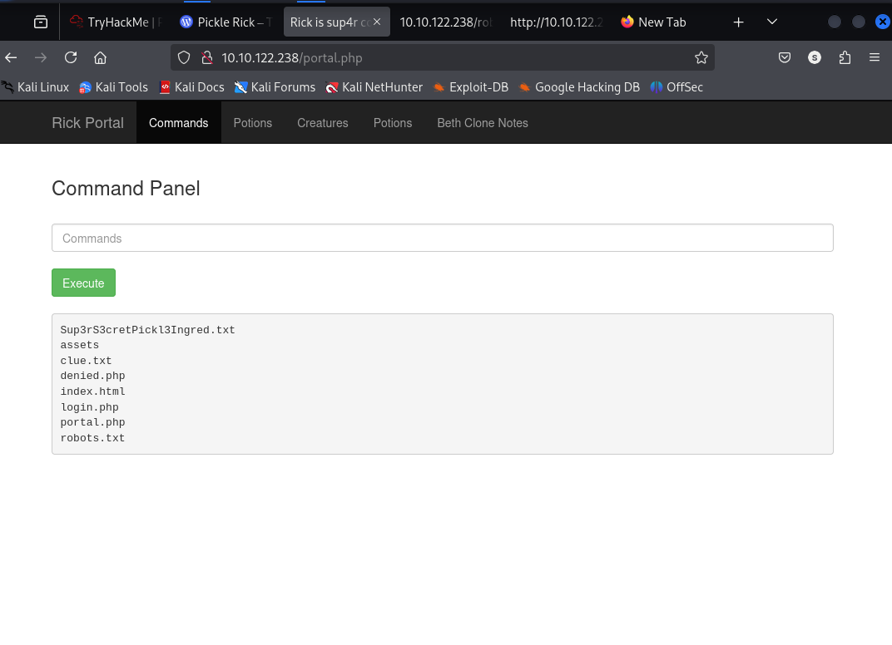
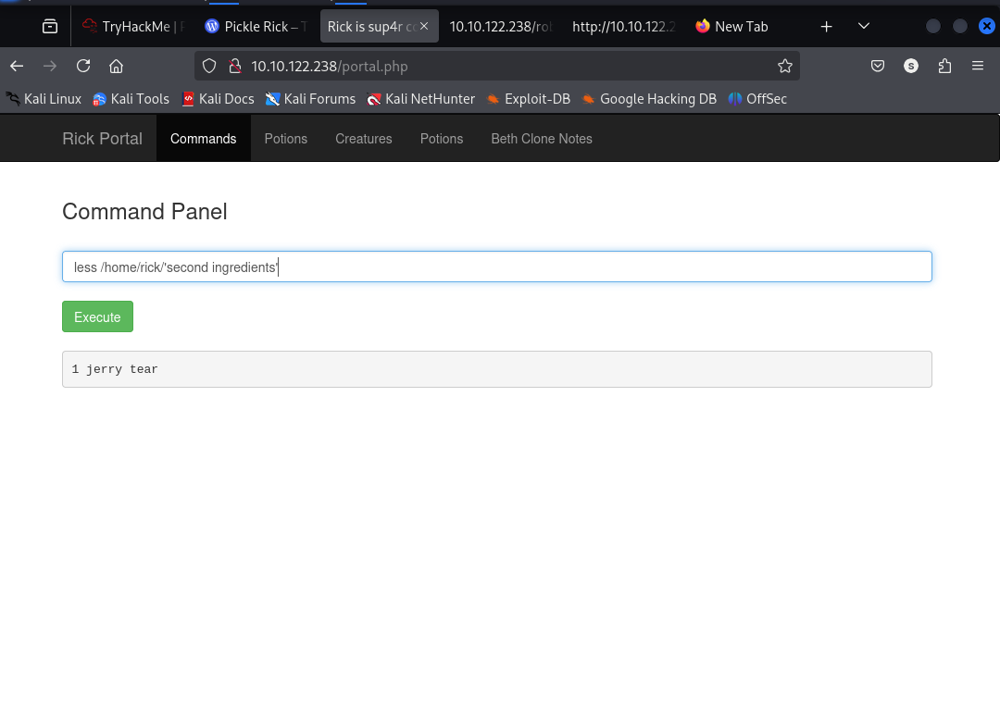
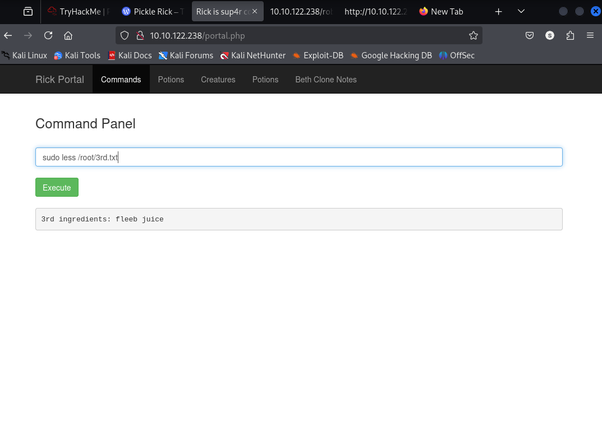

# [PICKLE RICK]
[TryHackMe Room Link](https://tryhackme.com/room/picklerick)

---
## Introduction
this writeup is for documenting the steps I took to complete Tryhackme.com (THM)’s room Pickle Rick hacking tasks.

---
## 🏆 Objective
This Ricky and Morty themed challenge requires you to exploit a webserver.
To find the three Flags.
Find the three ingredients that will help Rick make his potion to transform himself back into a human from a pickle.

---

## 🛠 Tools Used
- Nmap
- Gobuster
- netcat
- http://pentestmonkey.net/cheat-sheet/shells/reverse-shell-cheat-sheet

---

## 📝 Steps / Solution

1. **Find the open ports of machine using Nmap**

I ran an Nmap full-port service/version scan to discover open TCP ports and services:

```bash
nmap -T4 -p- -sV -vv 10.10.122.238
```

- `-p-` scans all 65535 TCP ports  
- `-sV` attempts service/version detection  
- `-T4` is aggressive but safer than `-T5` on target networks (avoid `-T5` on production/public infra)

**Sample output:**
```text
PORT     STATE SERVICE    VERSION
22/tcp   open  ssh        OpenSSH 8.2p1
80/tcp   open  http       Apache httpd 2.4.41
```
ports 22 & 80 are open!

2. **Browsed to webpage**
Reviewed the source of this page that gave a username “R1ckRul3s”.


3. **Used gobuster to brute force directories to discover directories and pages on this website. Gobuster discovered few interesting pages**
```bash
sudo gobuster dir -u http://10.10.122.238/ -w /usr/share/wordlists/dirb/common.txt -e -x php,html,txt -t 40 
```
`-u http://10.10.122.238/` Target URL to test
`-w /usr/share/wordlists/dirb/common.txt` The wordlist Gobuster will use
`-e (or --expanded)` Expanded mode — print full URLs
`-x php,html,txt (or --extensions)` Try the specified file extensions for each word
`-t 40` Number of concurrent threads (workers). Higher = faster but more load on target and your network. 40 is aggressive; if the target is slow or rate‑limits, lower it.


We found some intresting Directories as follows:
(a) login.php
(b) robots.txt
(c) server-status

4. **Browsed to “robots.txt” file and found one interesting piece of information there**
`Wubbalubbadubdub`
5. **Browsed to “login.php” and found a login page asking for a username and password**
Tried information gathered in previous steps to login to this portal.
username : `R1ckRul3s`
password : `Wubbalubbadubdub`

We got access to the command panel!

5. **Tried listing the contents of directory**
use: `ls`

Saw an interesting file “Sup3rS3cretPickl3Ingred.txt” but could not read contents of the file (using cat) as this functionality was disabled on the server.

6. **First flag to read**
Tried another command "less" to read the file : `less Sup3rS3cretPickl3Ingred.txt`
## got our first flag! ##


8. **Second Flag to read**
We tried to search second flag using command pannel in /home directory.
- `ls /home`
  we got:
    -rick
    -ubuntu
- `ls /home/rick`
  we got:
    -second ingredients
- `less /home/rick/'second ingredients`
## we finally got our second ingredient which is our 2nd flag! ##


8. **Third Flag to read**
Usually final flags need root access of target machines so we will try to gain root access to our target webserver.

 Check our permissions:
        - use `sudo -l` to check our permissions.
   
         output:
           
            Matching Defaults entries for www-data on ip-10-10-122-238:
                env_reset, mail_badpass, secure_path=/usr/local/sbin\:/usr/local/bin\:/usr/sbin\:/usr/bin\:/sbin\:/bin\:/snap/bin

            User www-data may run the following commands on ip-10-10-122-238:
                (ALL) NOPASSWD: ALL
  - It means: the user www-data may run any command as any user (including root) without being prompted for a password.
    
  - In sudoers notation: ALL (hosts) ALL (as whom) NOPASSWD: ALL (no password required for all commands).

  - Therefore being `www-data` user on system, we can execute any command which an root user can execute.

  `sudo ls /root` Being root user we can go inside root directory.
  `3rd.txt` root flag is found
  read '3rd.txt' using `sudo less /root/'3rd.txt'`.
  
  ## We found our final flag! ##
  
  I hope this helped. Thankyou!
   
